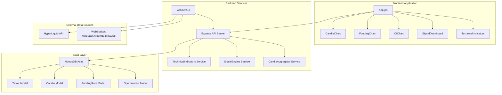

# HyperSignal - Hệ thống Phân tích Tín hiệu Giao dịch

## 🎯 Giới thiệu

HyperSignal là một hệ thống web toàn diện cho phân tích dữ liệu tài chính và tín hiệu giao dịch, được thiết kế dành riêng cho giao dịch perpetual futures. Hệ thống cung cấp thu thập dữ liệu thị trường thời gian thực, phân tích kỹ thuật và tạo tín hiệu tự động cho các hợp đồng tiền điện tử perpetual (ETH-PERP, BTC-PERP, SOL-PERP) từ sàn giao dịch HyperLiquid.

## 🏗️ Kiến trúc Hệ thống

HyperSignal theo kiến trúc ứng dụng web hiện đại với các dịch vụ frontend và backend riêng biệt, kết nối với các nhà cung cấp dữ liệu thị trường bên ngoài và lưu trữ bền vững.



## 🔄 API Endpoints và Luồng Dữ liệu

### REST API Endpoints

| Endpoint | Method | Mô tả |
|----------|---------|-------|
| `/api/candles` | GET | Lấy dữ liệu nến theo symbol, interval, limit |
| `/api/trades` | GET | Lấy lịch sử giao dịch |
| `/api/funding` | GET | Lấy dữ liệu funding rate |
| `/api/oi` | GET | Lấy dữ liệu open interest |
| `/api/indicators/:symbol` | GET | Lấy chỉ báo kỹ thuật |
| `/api/signals/all` | GET | Lấy tất cả tín hiệu giao dịch |
| `/api/aggregate` | POST | Kích hoạt tổng hợp dữ liệu |

### Frontend State Management

````javascript
const [symbol, setSymbol] = useState("ETH")
const [timeframe, setTimeframe] = useState("1h")
const [candles, setCandles] = useState([])
const [trades, setTrades] = useState([])
const [funding, setFunding] = useState([])
const [oi, setOI] = useState([])
const [indicatorData, setIndicatorData] = useState(null)
````

## 🧩 Thành phần Chính

### Frontend Application (React)

| Component | Chức năng | Tính năng chính |
|-----------|-----------|----------------|
| **App** | Điều phối chính | fetchData(), fetchIndicators(), triggerAggregation() |
| **CandleChart** | Biểu đồ nến OHLC | Hiển thị biểu đồ nến với chỉ báo kỹ thuật |
| **FundingChart** | Xu hướng funding rate | Hiển thị lịch sử funding rate |
| **OIChart** | Dữ liệu open interest | Hiển thị các chỉ số open interest |
| **SignalDashboard** | Tín hiệu giao dịch | Hiển thị tín hiệu tăng/giảm |
| **TechnicalIndicators** | Hiển thị phân tích | Render RSI, MACD, Bollinger Bands |
| **IndicatorFilters** | Chọn chỉ báo | Cho phép người dùng cấu hình chỉ báo |

### Backend Services (Node.js)

| Dịch vụ | Đường dẫn | Chức năng chính |
|---------|-----------|----------------|
| **Express API Server** | index.js | Xử lý route, phục vụ dữ liệu |
| **WebSocket Client** | wsClient.js | Thu thập dữ liệu thời gian thực |
| **Technical Indicators** | TechnicalIndicators.js | Tính toán RSI, MACD, SMA |
| **Signal Engine** | SignalEngine.js | Tạo tín hiệu giao dịch |
| **Candle Aggregator** | CandleAggregator.js | Xử lý đa timeframe |

## 🗄️ Mô hình Dữ liệu & Lưu trữ

### MongoDB Collections

**Ticker Collection**
```javascript
{
  symbol: String,      // ETH, BTC, SOL
  price: Number,       // Giá hiện tại
  volume: Number,      // Volume giao dịch
  time: Date          // Thời gian cập nhật
}
```

**Candle Collection**
```javascript
{
  symbol: String,      // Symbol giao dịch
  interval: String,    // 1m, 5m, 15m, 30m, 1h, 4h, 1d
  open: Number,        // Giá mở
  high: Number,        // Giá cao nhất
  low: Number,         // Giá thấp nhất
  close: Number,       // Giá đóng
  volume: Number,      // Volume
  startTime: Date,     // Thời gian bắt đầu
  endTime: Date        // Thời gian kết thúc
}
```

**FundingRate Collection**
```javascript
{
  symbol: String,      // Symbol
  rate: Number,        // Tỷ lệ funding
  time: Date          // Thời gian
}
```

**OpenInterest Collection**
```javascript
{
  symbol: String,      // Symbol
  value: Number,       // Giá trị open interest
  time: Date          // Thời gian
}
```

## ⚡ Tính năng Chính

### 🔴 Xử lý Dữ liệu Thời gian Thực
- **Tích hợp WebSocket**: Streaming dữ liệu liên tục từ HyperLiquid API
- **Tổng hợp Đa timeframe**: Xử lý nến 1 phút thành các khoảng 5m, 15m, 30m, 1h, 4h, 1d
- **Auto-refresh**: Frontend cập nhật mỗi 30 giây

### 📊 Phân tích Kỹ thuật
- **Chỉ báo**: RSI, MACD, Bollinger Bands, SMA (Simple Moving Average)
- **Tạo Tín hiệu**: Phát hiện tín hiệu tăng/giảm tự động
- **Bộ lọc**: Lựa chọn chỉ báo và tham số có thể cấu hình

### 💾 Lưu trữ Dữ liệu
- **TTL Indexes**: Tự động hết hạn dữ liệu (3-30 ngày)
- **Compound Indexes**: Tối ưu hóa truy vấn theo symbol + interval + time
- **Aggregation Pipeline**: Xử lý dữ liệu đa timeframe hiệu quả

### 🖥️ Giao diện Người dùng
- **Layout kiểu TradingView**: Giao diện giao dịch chuyên nghiệp
- **Responsive Design**: Sidebar và panel có thể thu gọn
- **Cập nhật Thời gian thực**: Feed giá trực tiếp và tính toán chỉ báo
- **Chuyển đổi Symbol**: Hỗ trợ ETH, BTC, SOL perpetual contracts

## 🚀 Cài đặt và Chạy

### Yêu cầu
- Node.js 16+
- MongoDB Atlas hoặc local MongoDB
- npm hoặc yarn

### Backend Setup
````bash
cd server
npm install
npm start
````

### Frontend Setup
````bash
cd client
npm install
npm run dev
````

### Environment Variables
````bash
# server/.env
MONGODB_URI=mongodb://localhost:27017/hypersignal
PORT=4000
WS_URL=wss://api.hyperliquid.xyz/ws
````

### Cấu hình MongoDB
````javascript
// Compound indexes for performance
db.candles.createIndex({ symbol: 1, interval: 1, startTime: -1 })
db.tickers.createIndex({ symbol: 1, time: -1 })
db.fundingrates.createIndex({ symbol: 1, time: -1 })
db.openinterests.createIndex({ symbol: 1, time: -1 })
````

## 📈 Luồng Dữ liệu

1. **WebSocket Client** nhận dữ liệu real-time từ HyperLiquid
2. **CandleAggregator** tự động tạo multiple timeframes
3. **TechnicalIndicators** tính toán các chỉ báo kỹ thuật
4. **SignalEngine** tạo tín hiệu giao dịch
5. **REST API** cung cấp dữ liệu cho frontend
6. **React App** hiển thị charts và analytics với cập nhật mỗi 30 giây

## 🛠️ Công nghệ Sử dụng

### Frontend
- React 18 + Vite
- TailwindCSS
- Framer Motion
- Chart.js + react-chartjs-2
- Axios
- React Hot Toast

### Backend
- Node.js + Express
- MongoDB + Mongoose
- WebSocket
- Technical Analysis Libraries
- CORS + Compression

## 📄 License

MIT License - Xem file LICENSE để biết thêm chi tiết.

---

**HyperSignal** - Nền tảng phân tích tín hiệu giao dịch thời gian thực cho perpetual futures! 🚀📊